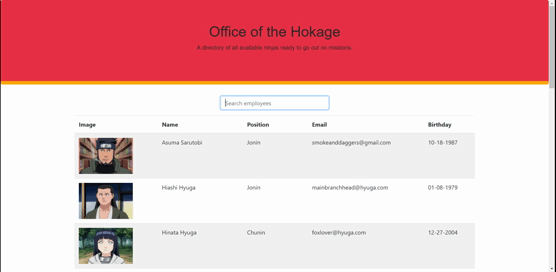

  # Employee Directory
  
  
  ## Table of Contents
  * [Description](#description)
  * [Installation](#installation)
  * [Usage](#usage)
  * [License](#license)
  * [Questions](#questions)
    
  ## Description
  
 Managers can keep track of their employees with images, names, emails, and DoB in an easy to read table. 

  
  ## Installation
  
 Run npm install to load the necessary npm packages to run the app 

  ## Usage
  
  
 Managers can view their employees on the home page. Once the page loads, all employees will be shown with their image, name, rank in organization, email, and date of birth displayed in their row.
 
    
  
Managers can arrange their employees in alphabetical order by clicking on the name column.
 
  
    
  
Managers may also search for specific employees by using the search bar at the top of the table.  

  

  ## License
  
 This app is covered under the MIT License 

  ## Questions
  
 For any questions, contact me at 

  <h3> Email : </h3>
  <strong>mckoyc@gmail.com</strong>
    
  <h3> Github Account:</h3>
  
  
  [mckoyc94](https://github.com/mckoyc94)
